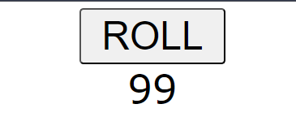

# Random Number Generator

This is a simple web application that allows users to generate random numbers with a click of a button. The project uses HTML, CSS, and JavaScript.



## Table of Contents

- [Overview](#overview)
- [Features](#features)
- [Usage](#usage)
- [Files](#files)
- [How to Run](#how-to-run)
- [Contributing](#contributing)
- [License](#license)

## Overview

This project demonstrates basic DOM manipulation using JavaScript. It includes a button to generate random numbers and display them on the screen.

## Features

- Generate random numbers with a single click.
- Simple and clean user interface.

## Usage

To use the application, simply click the "ROLL" button to generate a random number.

## Files

- `index.html`: The main HTML file that contains the structure of the application.
- `styles.css`: The CSS file that styles the HTML elements.
- `script.js`: The JavaScript file that contains the logic for generating random numbers.

## How to Run

1. Clone the repository:
    ```sh
    git clone https://github.com/your-username/random-number-generator.git
    ```

2. Navigate to the project directory:
    ```sh
    cd random-number-generator
    ```

3. Open `index.html` in a web browser to see the application in action.

## Contributing

Contributions are welcome! If you have any suggestions or improvements, feel free to create a pull request or open an issue.

## License

This project is licensed under the MIT License. See the `LICENSE` file for details.
