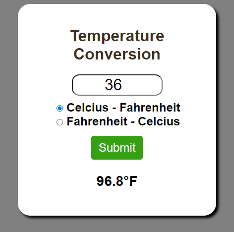

# Temperature Conversion Program

This is a simple web application that allows users to convert temperatures between Celsius and Fahrenheit. The project uses HTML, CSS, and JavaScript.



## Table of Contents

- [Overview](#overview)
- [Features](#features)
- [Usage](#usage)
- [Files](#files)
- [How to Run](#how-to-run)
- [Contributing](#contributing)
- [License](#license)

## Overview

This project demonstrates basic DOM manipulation using JavaScript. It includes an input field for the temperature value, radio buttons to select the conversion direction (Celsius to Fahrenheit or Fahrenheit to Celsius), and a submit button to perform the conversion.

## Features

- Convert Celsius to Fahrenheit.
- Convert Fahrenheit to Celsius.
- Simple and intuitive user interface.

## Usage

To use the application:
1. Enter the temperature value in the input field.
2. Select the conversion direction using the radio buttons.
3. Click the "Submit" button to see the converted temperature.

## Files

- `index.html`: The main HTML file that contains the structure of the application.
- `styles.css`: The CSS file that styles the HTML elements.
- `script.js`: The JavaScript file that contains the logic for converting temperatures.

## How to Run

1. Clone the repository:
    ```sh
    git clone https://github.com/your-username/temperature-conversion.git
    ```

2. Navigate to the project directory:
    ```sh
    cd temperature-conversion
    ```

3. Open `index.html` in a web browser to see the application in action.

## Contributing

Contributions are welcome! If you have any suggestions or improvements, feel free to create a pull request or open an issue.

## License

This project is licensed under the MIT License. See the `LICENSE` file for details.
